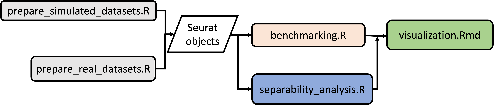

# scDemuxBench

This repository includes the code to replicate the results presented in "Systematic benchmark of single-cell hashtag demultiplexing approaches reveals robust performance of a clustering-based method" paper.

## Installation
```
if (!require("devtools", quietly = TRUE))
    install.packages("devtools")
    
devtools::install_github("hwlim/scDemuxBench")
```
## How to use  
The following flowchart shows different steps to download, preprocess and analysis real and simulated tag counts datasets.

